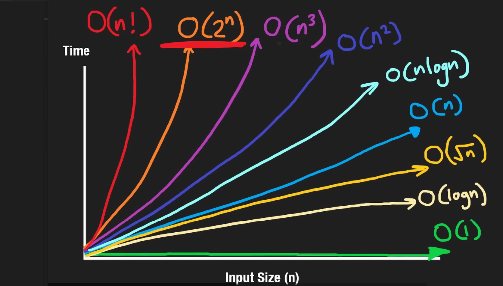

# Day 1: Big O Notation & Arrays

## 📝 Problem Solved
**Problem:** [Contains Duplicate (LeetCode 217)](https://leetcode.com/problems/contains-duplicate/)
- **Difficulty:** Easy
- **Goal:** Check if a list contains any duplicate numbers.

## 💡 What I Learned
Today I focused on understanding Time Complexity and the difference between Lists and Sets.
    

1. **Big O Notation:** 
    **Resource:** [Big O Notation Cheat Sheet](https://neetcode.io/courses/lessons/big-o-notation)
   - **O(n²):** Slow (checking every item against every other item).
   - **O(n):** Fast (checking items once).
   - **O(1):** Instant (looking up in a Hash Map/Set).

2. **Python Sets:**
    **Resource:** [Python Set](https://www.w3schools.com/python/python_sets.asp)
   - A `set` cannot have duplicates.
   - If `len(set(nums))` is smaller than `len(nums)`, duplicates existed!
   - Lookups in a Set are O(1) (Instant).

## 📸 Visual Notes
Here is the complexity chart I studied today:



## 💻 The Code
```python
class Solution:
    def containsDuplicate(self, nums: List[int]) -> bool:
        # Using a set to check for uniqueness
        # Time: O(n) | Space: O(n)
        return len(set(nums)) != len(nums)